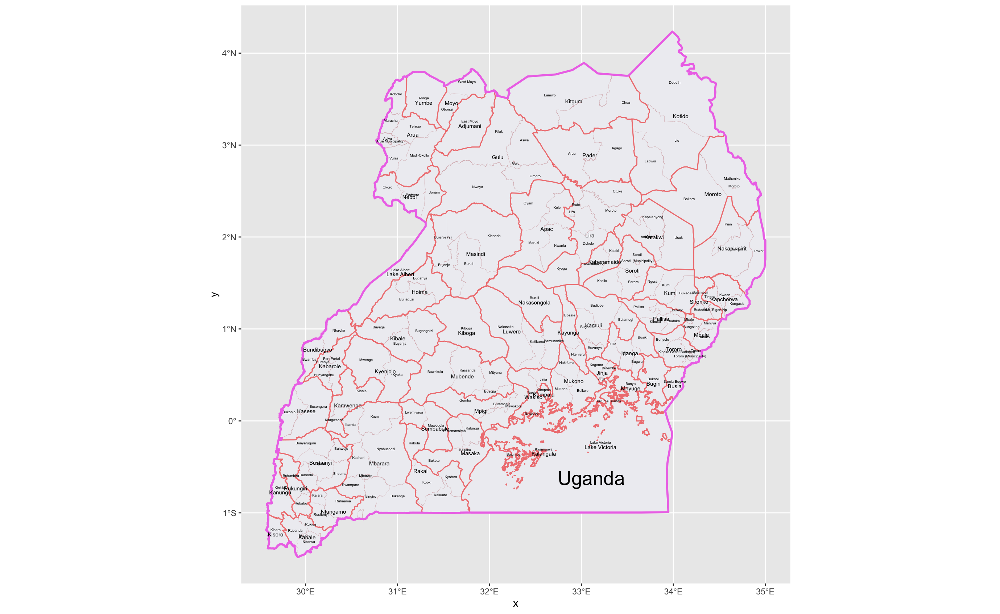
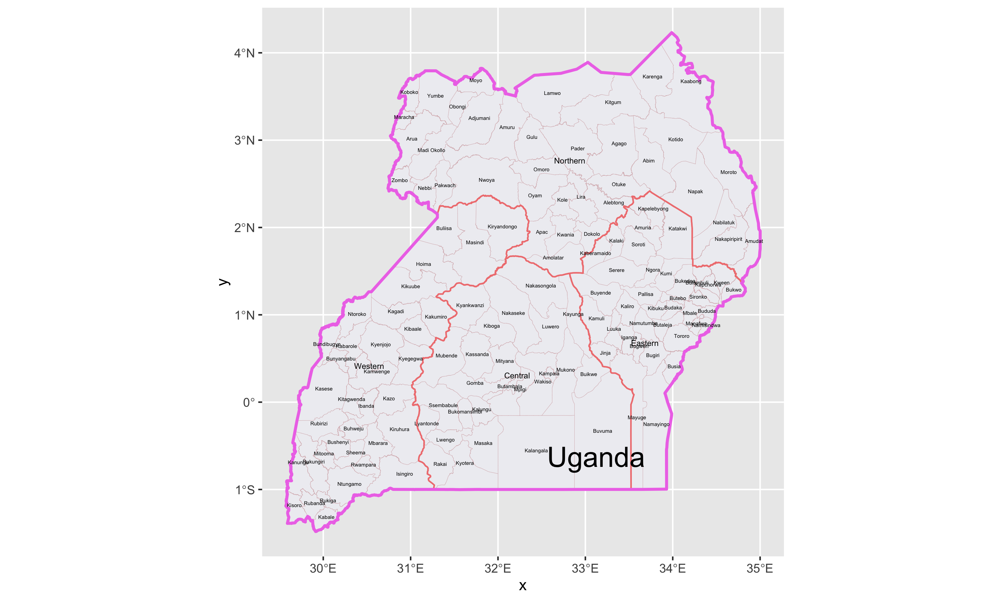
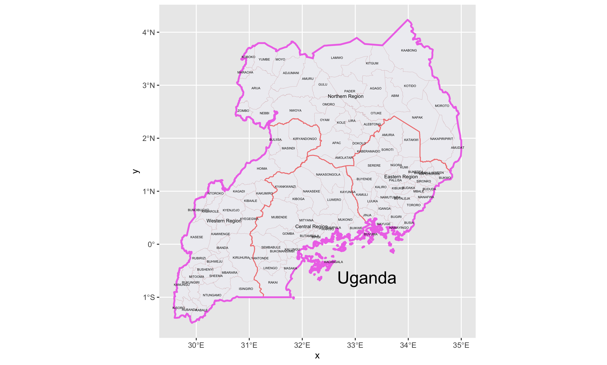

# Project 1 - Uganda 

### Map 1 - Data from GADM

### Map 2 - Data from HDX

### Map 3 - Data from GeoBoundaries

At first glance, the shapes of the maps look different, especially Map 3 from the other two maps.  However, that is due to the body of water, Lake Victoria, that GeoBoundaries does not mark as part of Uganda.  The first administrative level is very different from Map 1 to Map 2 and Map 3.  There are many more regions in Map 1, and they have regional names, rather than just directions (Northern Region, Western Region, etc.).  

It is interesting to consider how the different databases collect their data.  GADM does not state where they get their data, but HDX gets their data from submitted data that is then reviewed and verified, and geoBoundaries collected the the longitudes and latitudes of each administrative boundary, then contacted each authority to ascertain where each boundary lied locally.  Short of actually visiting each district, the geoBoundaries method seems the most in depth and thourough.  

### 
