# Project 4

## Part 1

### Kampala

##### Population
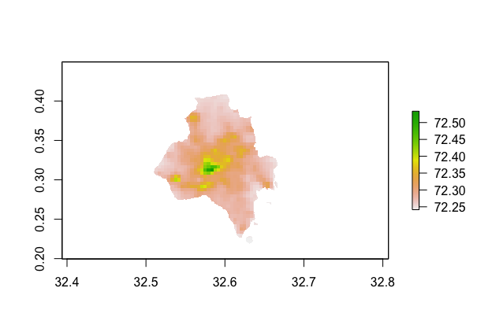
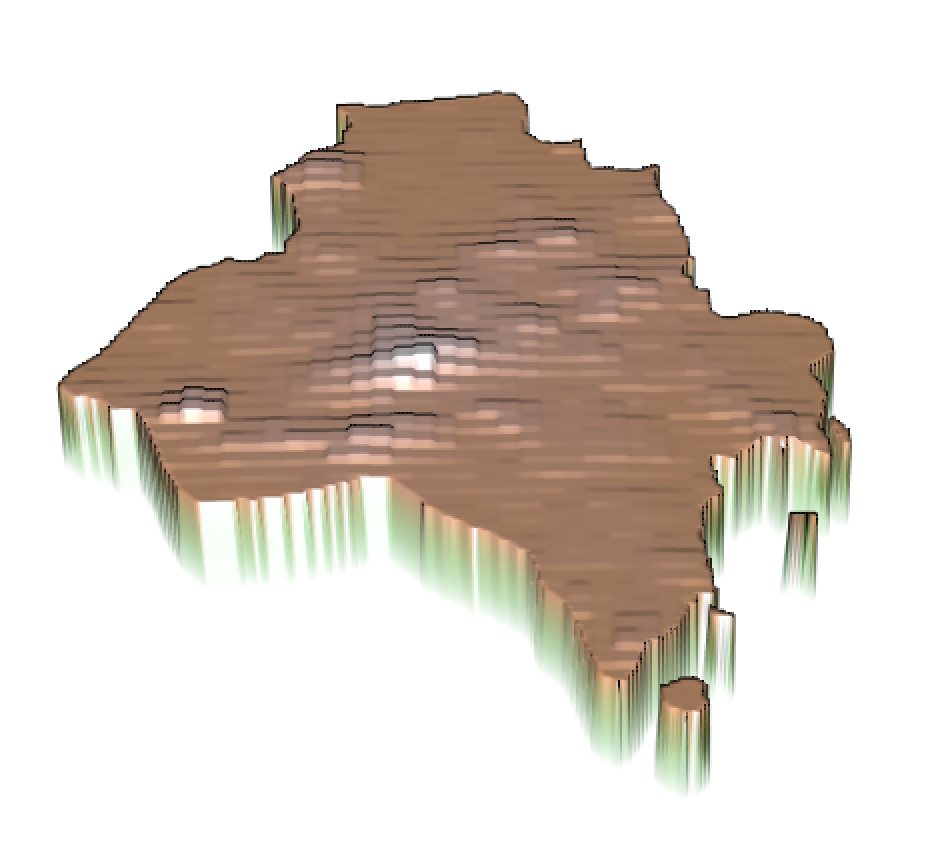

##### Difference
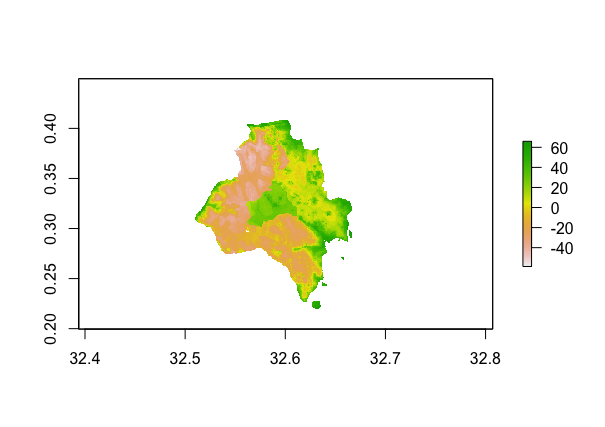
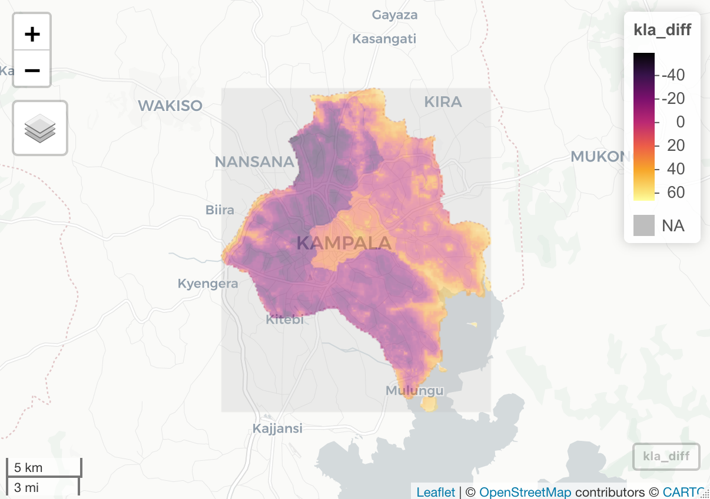

### Mbarara

##### Population
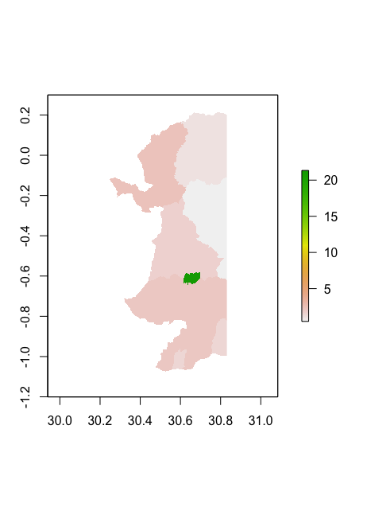

##### Difference
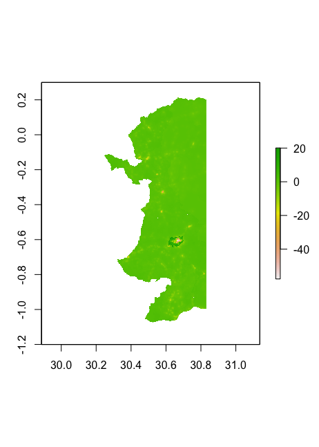

## Part 2

### Sum

##### Predicted Population
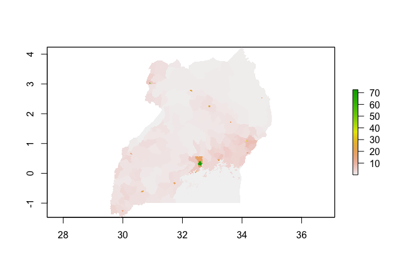

##### Predicted Difference
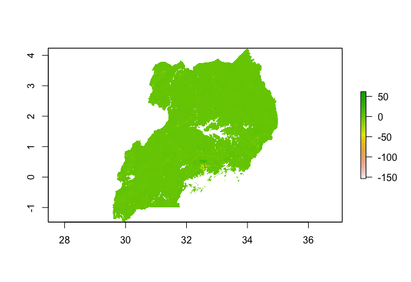

### Mean

##### Predicted Population
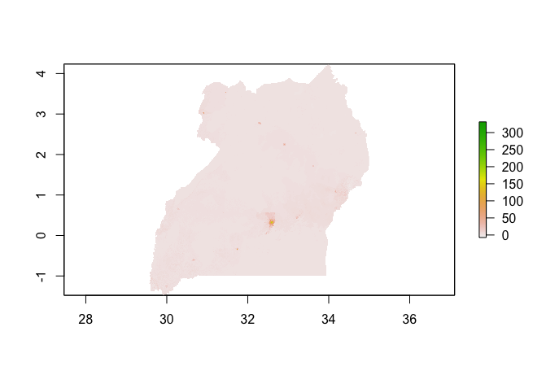

##### Predicted Difference
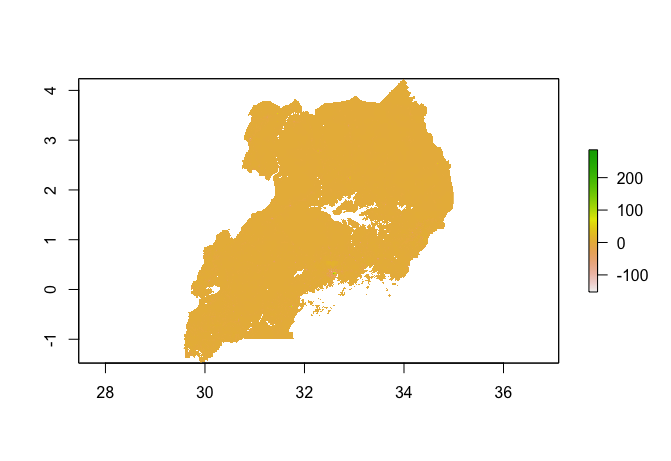
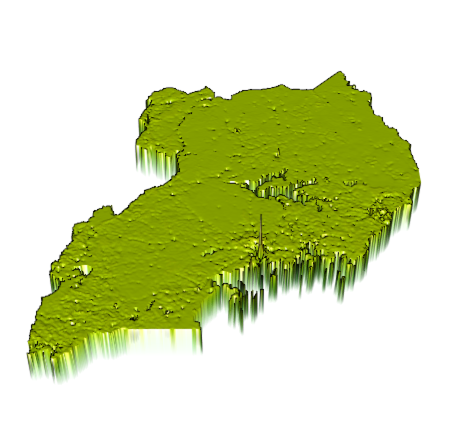

### Log of Population

##### Predicted Population
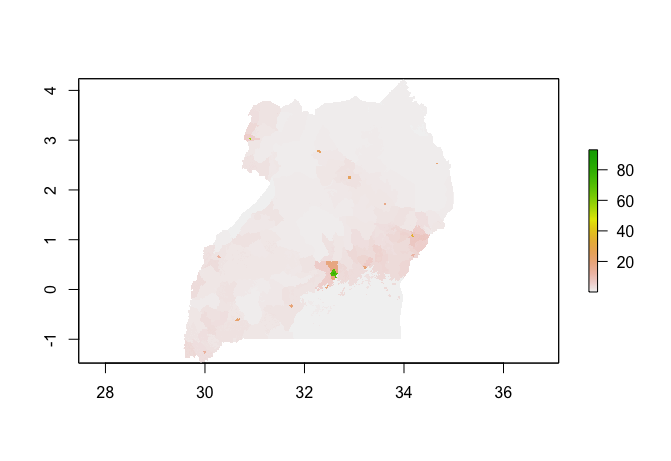

##### Predicted Difference

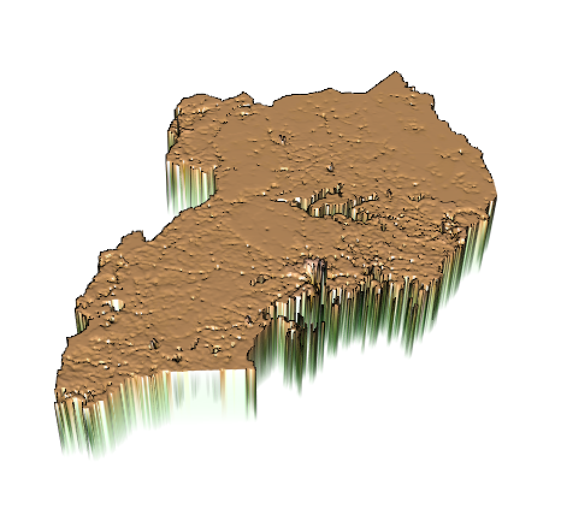

### Assessment

Each of the difference plots have a clear average of 0, showing that all three plots are very similar in accuracy.  The plot with using the means of the covariates, however, 

