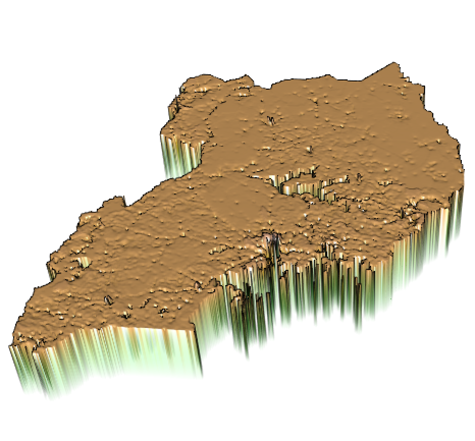

# Project 4

## Part 1

### Kampala

##### Population

##### Difference

### Mbarara

##### Population

##### Difference

## Part 2

### Sum

##### Predicted Population

##### Predicted Difference

### Mean

##### Predicted Population

##### Predicted Difference

### Log of Population

##### Predicted Population

##### Predicted Difference

### Assessment

Each of the difference plots have a clear average of 0, showing that all three plots are very similar in accuracy.  The plot with using the means of the covariates, however, 

